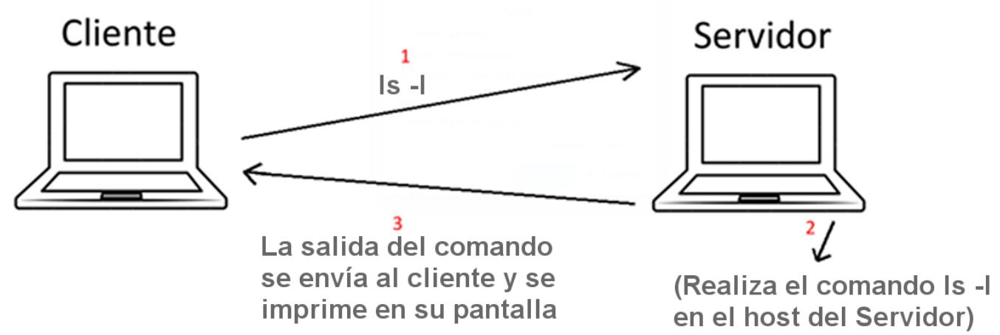

# Cliente - Servidor SSH (Proyecto final)

## Asignatura: Arquitectura Cliente-Servidor
## Semestre: 2024-1 

## Objetivo
El proyecto consiste en crear un Cliente-Servidor que ejecute comandos remotamente, como ocurre con un Cliente-Servidor SSH comenrcial o gratuito. El proyecto debe cumplir con los siguientes requerimientos:

* Estar desarrollado en una arquitectura Cliente-Servidor, con sockets TCP/IP y con conexión remota. Aunque los códigos los desarrolles en una misma máquina y los pruebes localmente, pero la revisión será remota de host a host.
* Debe estar desarrollado en un ambiente Linux, en la distribución que gustes o en MacOSy programado en lenguanje C.
* No se aceptan proyectos programados en otros lenguajes.

## Explicación del proyecto
* La comunicación entre el Cliente y el Servidor debe ser remota vía sockets TCP (Sockets Internet).
* El programa Servidor debe iniciarse en el host servidor (en el puerto que decidas).
* El programa Cliente debe iniciarse en el host cliente (pasando el dominio o IP del servidor y el puerto desde la línea de comandos).
* El servidor acepta la conexión.
* Una vez aceptada la conexión, el Cliente escribe el comando desde teclado y lo envía por el
socket al Servidor (Paso # 1 de la imagen). En este ejemplo se muestra el comando ls –l pero
puede ser cualquier comando de Linux o MacOS.
* El Servidor recibe el comando y lo ejecuta en sistema local (Paso # 2 de la imagen). Puedes
usar las siguientes funciones: fork() y exec() o la función popen()
* El Servidor debe devolver la salida al cliente (Paso # 3 de la imagen) y el cliente imprime la
respuesta en pantalla

  

